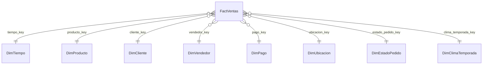

# Visualización de Datos II - Propuesta para PlayApp

## 1. Identificación de las fuentes de datos

### Contexto del sistema
`PlayApp` es una aplicación web orientada a la compra de productos y servicios en playas de Cartagena. A partir de su estructura actual, se identifican varias fuentes de datos operacionales y analíticas que pueden alimentar un proceso de inteligencia de negocios.

### Fuentes de datos principales

#### 1. MongoDB
Es la fuente transaccional principal del sistema. La aplicación está configurada para conectarse a la base `playappdb` mediante la propiedad:

`spring.data.mongodb.database=playappdb`

Las colecciones más relevantes para analítica son:

- `pedidos`: almacena el pedido completo, con total, fecha, estado, cliente, pago, envío y detalle de productos comprados.
- `productos`: contiene nombre, descripción, precio, stock, tipo, categoría y vendedor responsable.
- `entidades`: representa a los usuarios del sistema, tanto clientes como administradores/vendedores.
- `pagos`: guarda método de pago, valor, estado y fecha.
- `envios`: incluye ubicación y datos logísticos como carpa, mesa, dirección, latitud y longitud.
- `reseñas`: contiene valoración, comentario y fecha de la opinión del cliente.

Tipo de dato:
- Semiestructurado, orientado a documentos NoSQL.

Forma de acceso:
- Repositorios Spring Data MongoDB.
- `MongoTemplate` para operaciones avanzadas.
- Posible conexión desde Power BI mediante exportación a CSV/Excel o conectores intermedios hacia MongoDB.

#### 2. Redis
El proyecto también está configurado para usar Redis:

- `spring.data.redis.host=localhost`
- `spring.data.redis.port=6379`

Tipo de dato:
- Clave-valor, orientado a caché.

Uso dentro del proyecto:
- Soporte operativo para sesiones o almacenamiento temporal.

Valor analítico:
- Bajo como fuente principal del Data Warehouse.
- Puede aportar métricas de comportamiento en tiempo real si en el futuro se almacenan eventos de navegación, carritos o sesiones.

#### 3. Archivo analítico de ventas para predicción
Existe un archivo de datos entrenable en:

`src/main/resources/weka/dataset_ventas.arff`

Este dataset contiene atributos como:

- día de la semana
- producto
- categoría
- precio
- clima
- temporada
- cantidad vendida

Tipo de dato:
- Estructurado en archivo plano analítico.

Forma de acceso:
- Lectura local por el componente de predicción con Weka.
- Puede ser importado directamente a Power BI o a una tabla staging del Data Warehouse.

Valor analítico:
- Muy alto para análisis de demanda, comportamiento por clima y estacionalidad.

### Resumen de fuentes

| Fuente | Tipo | Acceso | Uso en BI |
|---|---|---|---|
| MongoDB | NoSQL semiestructurado | Repositorios y `MongoTemplate` | Fuente principal del DW |
| Redis | Clave-valor | Cliente Redis | Soporte operativo, no central |
| `dataset_ventas.arff` | Archivo estructurado | Lectura local/Weka | Predicción y análisis histórico |

## 2. Modelo dimensional propuesto

### Elección del modelo
Se recomienda un **esquema estrella** en lugar de copo de nieve, porque:

- simplifica el análisis en Power BI
- mejora el rendimiento de consulta
- facilita la comprensión del modelo para usuarios de negocio
- encaja bien con indicadores comerciales y operativos

### Proceso de negocio a modelar
El proceso principal es la **venta de productos y servicios en la playa**, desde la generación del pedido hasta el pago y la entrega.

### Grano de la tabla de hechos
El grano recomendado es:

**una fila por ítem vendido dentro de cada pedido**

Esto permite analizar:

- productos más vendidos
- ingresos por categoría
- cantidades por cliente
- desempeño por vendedor
- pedidos por fecha, zona o método de pago

### Esquema estrella propuesto

#### Tabla de hechos: `FactVentas`

Medidas:
- `cantidad_vendida`
- `subtotal`
- `total_pedido`
- `valor_pago`
- `stock_producto` (opcional como snapshot)

Claves foráneas:
- `tiempo_key`
- `producto_key`
- `cliente_key`
- `vendedor_key`
- `pago_key`
- `ubicacion_key`
- `estado_pedido_key`
- `clima_temporada_key` (opcional si se integra el dataset ARFF)

#### Dimensiones

##### `DimTiempo`
- `tiempo_key`
- `fecha`
- `anio`
- `semestre`
- `trimestre`
- `mes`
- `nombre_mes`
- `semana`
- `dia`
- `dia_semana`
- `es_fin_de_semana`

##### `DimProducto`
- `producto_key`
- `producto_id_origen`
- `nombre_producto`
- `descripcion`
- `categoria`
- `tipo`
- `precio_unitario`

##### `DimCliente`
- `cliente_key`
- `cliente_id_origen`
- `nombre_cliente`
- `correo`
- `rol`

##### `DimVendedor`
- `vendedor_key`
- `vendedor_id_origen`
- `nombre_vendedor`
- `correo_vendedor`

##### `DimPago`
- `pago_key`
- `metodo_pago`
- `estado_pago`

##### `DimUbicacion`
- `ubicacion_key`
- `direccion`
- `carpa`
- `mesa`
- `latitud`
- `longitud`
- `zona_playa`

##### `DimEstadoPedido`
- `estado_pedido_key`
- `codigo_estado`
- `nombre_estado`

##### `DimClimaTemporada`
- `clima_temporada_key`
- `clima`
- `temporada`
- `dia_semana_referencia`

### Relación lógica del modelo



## 3. Diseño y prototipo del Data Warehouse

### Arquitectura recomendada

Se propone una arquitectura de tres capas:

1. **Fuente operacional**
   MongoDB, Redis y archivo ARFF.
2. **Staging**
   Extracción y limpieza de datos en tablas temporales o archivos intermedios.
3. **Data Warehouse**
   Modelo dimensional en estrella para consumo analítico.

### Flujo ETL propuesto

#### Extracción
- Extraer pedidos desde MongoDB.
- Desanidar el arreglo `carrito` de cada pedido para generar un registro por producto vendido.
- Extraer productos, usuarios, pagos, envíos y reseñas.
- Importar el archivo `dataset_ventas.arff` como fuente externa de apoyo.

#### Transformación
- Convertir fechas a dimensiones de tiempo.
- Homologar categorías de producto: comida, bebida, servicio.
- Traducir estados numéricos a descripciones legibles.
- Separar cliente y vendedor como dimensiones distintas.
- Normalizar campos geográficos de envío.
- Vincular clima y temporada cuando exista correspondencia con fecha o producto.

#### Carga
- Cargar primero dimensiones.
- Cargar luego la tabla `FactVentas`.
- Opcionalmente crear una segunda tabla de hechos `FactResenas`.

### Prototipo lógico del DW

#### `FactVentas`

| Campo | Descripción |
|---|---|
| `venta_key` | Clave sustituta |
| `pedido_id` | Id del pedido origen |
| `tiempo_key` | Relación con tiempo |
| `producto_key` | Relación con producto |
| `cliente_key` | Relación con cliente |
| `vendedor_key` | Relación con vendedor |
| `pago_key` | Relación con pago |
| `ubicacion_key` | Relación con ubicación |
| `estado_pedido_key` | Relación con estado |
| `clima_temporada_key` | Relación con clima/temporada |
| `cantidad_vendida` | Cantidad del ítem |
| `subtotal` | Subtotal por ítem |
| `total_pedido` | Total global del pedido |
| `valor_pago` | Valor pagado |

#### `FactResenas` opcional

| Campo | Descripción |
|---|---|
| `resena_key` | Clave sustituta |
| `tiempo_key` | Fecha de la reseña |
| `cliente_key` | Usuario que comenta |
| `producto_key` | Si se asocia a producto |
| `valoracion` | Puntuación |
| `cantidad_resena` | Siempre 1 |

### KPIs sugeridos para el DW

- ventas totales
- cantidad de pedidos
- ticket promedio
- cantidad de productos vendidos
- ventas por categoría
- ventas por vendedor
- ventas por método de pago
- ventas por carpa o zona
- nivel promedio de valoración
- tendencia de demanda por clima y temporada

## 4. Diseño y prototipo del Dashboard interactivo en Power BI

### Objetivo del dashboard
Permitir a administradores y responsables comerciales visualizar el comportamiento de ventas, productos, clientes y operación logística para apoyar la toma de decisiones.

### Página 1: Resumen ejecutivo

Indicadores:
- ventas totales
- número de pedidos
- ticket promedio
- productos vendidos
- clientes atendidos

Visuales:
- tarjeta KPI de ventas
- tarjeta KPI de pedidos
- línea de tendencia de ventas por fecha
- barra de ventas por categoría
- dona de ventas por método de pago

Filtros:
- rango de fechas
- categoría
- método de pago
- vendedor

### Página 2: Análisis comercial

Visuales:
- top 10 productos más vendidos
- ventas por vendedor
- matriz por producto, categoría y total vendido
- participación porcentual por categoría

Objetivo:
- detectar productos estrella
- identificar categorías más rentables
- comparar desempeño entre vendedores o entidades

### Página 3: Análisis operativo y geográfico

Visuales:
- mapa con latitud y longitud de envíos
- gráfico por carpa o mesa
- pedidos por estado
- tiempo de pedidos por día o franja horaria si se amplía el dato temporal

Objetivo:
- entender concentración geográfica de pedidos
- analizar la operación en playa
- detectar zonas con mayor demanda

### Página 4: Comportamiento y predicción

Fuente principal:
- `dataset_ventas.arff`

Visuales:
- ventas por clima
- ventas por temporada
- ventas por día de la semana
- dispersión precio vs cantidad vendida
- proyección de demanda por tipo de producto

Objetivo:
- anticipar demanda
- ajustar inventario
- definir estrategias comerciales según clima y temporada

### Segmentadores recomendados

- fecha
- categoría
- producto
- clima
- temporada
- vendedor
- estado del pedido
- método de pago

### Medidas DAX sugeridas

```DAX
Ventas Totales = SUM(FactVentas[subtotal])

Pedidos Totales = DISTINCTCOUNT(FactVentas[pedido_id])

Ticket Promedio = DIVIDE([Ventas Totales], [Pedidos Totales])

Cantidad Vendida = SUM(FactVentas[cantidad_vendida])

Clientes Unicos = DISTINCTCOUNT(FactVentas[cliente_key])
```

## 5. Conclusión

El proyecto `PlayApp` ya dispone de datos suficientes para construir una solución de inteligencia de negocios. La mejor alternativa es usar un **esquema estrella** con `FactVentas` como núcleo, alimentado principalmente desde MongoDB y complementado por el dataset analítico de Weka. Sobre este modelo, Power BI puede ofrecer un dashboard interactivo orientado a ventas, operación en playa, comportamiento del cliente y apoyo a predicción de demanda.

## 6. Recomendación de presentación

Si esta entrega es para exposición o documento académico, puedes presentarla en este orden:

1. Descripción breve de PlayApp.
2. Fuentes de datos y tipo de acceso.
3. Justificación del esquema estrella.
4. Diseño del Data Warehouse.
5. Mockup o propuesta del dashboard en Power BI.
6. Beneficios para la toma de decisiones.

## 7. Evidencias del proyecto usadas como base

- [README.md](C:/Users/sear0/OneDrive/Escritorio/PlayApp/PlayApp/README.md)
- [application.properties](C:/Users/sear0/OneDrive/Escritorio/PlayApp/PlayApp/src/main/resources/application.properties)
- [Pedido.java](C:/Users/sear0/OneDrive/Escritorio/PlayApp/PlayApp/src/main/java/com/proyecto/PlayApp/entity/Pedido.java)
- [Producto.java](C:/Users/sear0/OneDrive/Escritorio/PlayApp/PlayApp/src/main/java/com/proyecto/PlayApp/entity/Producto.java)
- [Pago.java](C:/Users/sear0/OneDrive/Escritorio/PlayApp/PlayApp/src/main/java/com/proyecto/PlayApp/entity/Pago.java)
- [Envio.java](C:/Users/sear0/OneDrive/Escritorio/PlayApp/PlayApp/src/main/java/com/proyecto/PlayApp/entity/Envio.java)
- [Usuario.java](C:/Users/sear0/OneDrive/Escritorio/PlayApp/PlayApp/src/main/java/com/proyecto/PlayApp/entity/Usuario.java)
- [Resena.java](C:/Users/sear0/OneDrive/Escritorio/PlayApp/PlayApp/src/main/java/com/proyecto/PlayApp/entity/Resena.java)
- [RandonDataService.java](C:/Users/sear0/OneDrive/Escritorio/PlayApp/PlayApp/src/main/java/com/proyecto/PlayApp/service/RandonDataService.java)
- [dataset_ventas.arff](C:/Users/sear0/OneDrive/Escritorio/PlayApp/PlayApp/src/main/resources/weka/dataset_ventas.arff)
